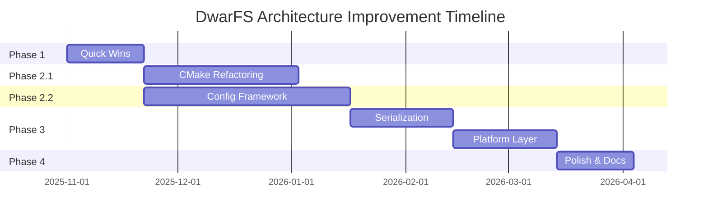

# DwarFS Architecture Improvement Roadmap

## Executive Summary

This roadmap provides a prioritized, phased approach to implementing the architectural improvements identified in the comprehensive review. The plan balances quick wins with long-term structural improvements, ensuring continuous value delivery while moving toward a fully configuration-driven, clean OOP architecture.

**Total Timeline:** 6-9 months
**Estimated Effort:** ~40-55 person-weeks
**Primary Goal:** 100% configuration-driven architecture with clean OOP throughout

---

## Priority Matrix

```
Impact vs Effort Matrix:

High Impact │
           │  ┌─────────┐
           │  │ Phase 1 │ Quick Wins
           │  │  2-3w   │
           │  └─────────┘
           │                    ┌──────────────┐
           │                    │   Phase 2    │ Major Refactoring
           │                    │ CMake + Config│
           │                    │    10-14w    │
           │                    └──────────────┘
           │
           │  ┌─────────┐       ┌─────────┐
Low Impact │  │ Phase 4 │       │ Phase 3 │ Foundation Building
           │  │  2-3w   │       │  6-8w   │
           │  └─────────┘       └─────────┘
           │
           └────────────────────────────────────
              Low Effort      High Effort
```

---

## Phase Overview

| Phase | Duration | Focus | Impact | Risk |
|-------|----------|-------|--------|------|
| **Phase 1** | 2-3 weeks | Quick Wins | HIGH | LOW |
| **Phase 2** | 10-14 weeks | CMake + Config Framework | HIGH | MEDIUM |
| **Phase 3** | 6-8 weeks | Serialization + Platform | MEDIUM | LOW |
| **Phase 4** | 2-3 weeks | Polish + Documentation | MEDIUM | LOW |

**Total: 20-28 weeks (5-7 months)**

---

## Phase 1: Quick Wins (Weeks 1-3)

### Objective
Deliver immediate value with low-risk improvements that demonstrate the architecture vision.

### Tasks

#### 1.1 Documentation & Standards (Week 1)
**Effort:** 1 week
**Priority:** HIGH
**Risk:** LOW

- [ ] Create OOP design patterns guide
- [ ] Document current compression registry pattern
- [ ] Create code review checklist
- [ ] Establish coding standards document
- [ ] Add architecture diagrams to README

**Deliverables:**
- `doc/DESIGN_PATTERNS.md`
- `doc/CODE_REVIEW_CHECKLIST.md`
- `doc/CODING_STANDARDS.md`
- Updated README with architecture diagrams

**Success Metrics:**
- All documents reviewed and approved
- Team trained on new standards

#### 1.2 Configuration File Structure Setup (Week 2)
**Effort:** 1 week
**Priority:** HIGH
**Risk:** LOW

- [ ] Create `config/` directory structure
- [ ] Add `config/serialization_config.yaml` (already exists, validate)
- [ ] Create placeholder for `config/dwarfs-config.yaml`
- [ ] Add configuration schema validation scripts
- [ ] Document configuration file format

**Deliverables:**
- Configuration directory structure
- Schema validation tooling
- Configuration documentation

**Success Metrics:**
- Configuration files validate against schema
- Documentation complete

#### 1.3 Internal Code Organization (Week 3)
**Effort:** 1 week
**Priority:** MEDIUM
**Risk:** LOW

- [ ] Document distinction between `internal/` and `detail/`
- [ ] Create usage guidelines
- [ ] Audit current usage
- [ ] Plan migration if needed

**Deliverables:**
- Clear guidelines for `internal/` vs `detail/`
- Audit report
- Migration plan (if needed)

**Success Metrics:**
- Team consensus on usage
- No new violations in code reviews

---

## Phase 2: CMake Build System & Configuration Framework (Weeks 4-17)

### Objective
Refactor CMake build system and create comprehensive configuration management framework.

### 2.1 CMake Build System Refactoring (Weeks 4-9)
**Effort:** 6 weeks
**Priority:** HIGH
**Risk:** MEDIUM

#### Week 4: Dependency Configuration
- [ ] Create `cmake/config/dependencies.yaml`
- [ ] Implement Python configuration parser
- [ ] Create CMake dependency loading functions
- [ ] Test with existing dependencies

**Dependencies:** None
**Risk Mitigation:** Parallel to existing system, gradual cutover

#### Week 5: Module Structure
- [ ] Create `cmake/modules/DwarfsCompression.cmake`
- [ ] Create `cmake/modules/DwarfsSerialization.cmake`
- [ ] Create `cmake/modules/DwarfsFUSE.cmake`
- [ ] Create `cmake/modules/DwarfsTools.cmake`
- [ ] Extract code from main CMakeLists.txt

**Dependencies:** Week 4
**Risk Mitigation:** One module at a time, verify builds

#### Week 6: Platform Abstraction
- [ ] Create `cmake/config/platforms.yaml`
- [ ] Implement platform detection system
- [ ] Extract platform-specific code
- [ ] Test on Windows, macOS, Linux

**Dependencies:** Week 5
**Risk Mitigation:** Platform-specific testing in CI

#### Week 7: Main CMakeLists.txt Refactoring
- [ ] Integrate all modules
- [ ] Remove duplicated code
- [ ] Simplify main CMakeLists.txt
- [ ] Target: <300 lines

**Dependencies:** Weeks 4-6
**Risk Mitigation:** Keep old version as backup

#### Weeks 8-9: Testing & Validation
- [ ] Test all build configurations
- [ ] Test on all platforms
- [ ] Update CI/CD workflows
- [ ] Performance validation
- [ ] Update documentation

**Dependencies:** Week 7
**Risk Mitigation:** Comprehensive test matrix

**Phase 2.1 Deliverables:**
- Modular CMake structure
- Configuration-driven dependency management
- Platform abstraction
- Simplified main CMakeLists.txt (<300 lines, down from 1412)
- Updated CI/CD workflows

**Success Metrics:**
- ✓ All existing builds work
- ✓ No performance regression
- ✓ CMakeLists.txt reduced by >75%
- ✓ Clear module boundaries
- ✓ All platforms tested

### 2.2 Configuration Management Framework (Weeks 10-17)
**Effort:** 8 weeks
**Priority:** HIGH
**Risk:** MEDIUM

#### Weeks 10-11: Core Infrastructure
- [ ] Create `libdwarfs_config` library structure
- [ ] Implement YAML parser using yaml-cpp
- [ ] Create basic configuration classes
- [ ] Add validation framework
- [ ] Unit tests for parser

**Dependencies:** None (can run parallel to 2.1)
**Risk Mitigation:** Isolated library, extensive testing

#### Weeks 12-13: Configuration Accessors
- [ ] Implement `BuildConfig` class
- [ ] Implement `DependencyConfig` class
- [ ] Implement `CompressionConfig` class
- [ ] Implement `SerializationConfig` class
- [ ] Implement `FeatureConfig` class
- [ ] Unit tests for all classes

**Dependencies:** Weeks 10-11
**Risk Mitigation:** One class at a time, TDD approach

#### Weeks 14-15: Integration
- [ ] Integrate with compression registry
- [ ] Integrate with serialization system
- [ ] Update CMake to generate embedded config
- [ ] Add runtime config file support
- [ ] Integration tests

**Dependencies:** Weeks 12-13, Phase 2.1
**Risk Mitigation:** Feature flags for gradual rollout

#### Weeks 16-17: Master Configuration File
- [ ] Create complete `config/dwarfs-config.yaml`
- [ ] Implement all sections
- [ ] Add validation rules
- [ ] Create environment-specific overrides
- [ ] Documentation and examples

**Dependencies:** Weeks 14-15
**Risk Mitigation:** Schema validation, extensive examples

**Phase 2.2 Deliverables:**
- `libdwarfs_config` library
- Complete master configuration file
- Configuration validation framework
- Runtime configuration support
- Comprehensive documentation

**Success Metrics:**
- ✓ All config sections implemented
- ✓ 100% unit test coverage
- ✓ Validation catches errors
- ✓ Zero hardcoded values in new code
- ✓ Documentation complete

---

## Phase 3: Serialization Registry & Platform Layer (Weeks 18-25)

### Objective
Complete registry pattern for serialization and add platform abstraction layer.

### 3.1 Serialization Registry Pattern (Weeks 18-21)
**Effort:** 4 weeks
**Priority:** MEDIUM
**Risk:** LOW

#### Week 18: Registry Infrastructure
- [ ] Create `SerializationRegistry` class
- [ ] Implement format registration mechanism
- [ ] Add magic byte detection
- [ ] Unit tests

**Dependencies:** Phase 2.2
**Risk Mitigation:** Based on proven compression registry pattern

#### Week 19: Configuration Integration
- [ ] Load formats from config file
- [ ] Implement format factories
- [ ] Add validation
- [ ] Integration tests

**Dependencies:** Week 18
**Risk Mitigation:** Configuration already designed and tested

#### Week 20: Serializer Integration
- [ ] Update `CerealBinarySerializer` integration
- [ ] Update `ThriftCompactSerializer` integration
- [ ] Test format detection
- [ ] Backward compatibility verification

**Dependencies:** Week 19
**Risk Mitigation:** Existing serializers already work

#### Week 21: Testing & Documentation
- [ ] Comprehensive unit tests
- [ ] Integration tests
- [ ] Update documentation
- [ ] Example code

**Dependencies:** Week 20
**Risk Mitigation:** Test with existing file formats

**Phase 3.1 Deliverables:**
- Complete serialization registry
- Configuration-driven format registration
- Automatic format detection
- Updated documentation

**Success Metrics:**
- ✓ All formats detected correctly
- ✓ Registry pattern consistent with compression
- ✓ No hardcoded format information
- ✓ Backward compatible

### 3.2 Platform Abstraction Layer (Weeks 22-25)
**Effort:** 4 weeks
**Priority:** MEDIUM
**Risk:** LOW

#### Week 22: Platform Detection
- [ ] Create `PlatformInfo` class
- [ ] Implement OS/architecture detection
- [ ] Add feature detection
- [ ] Unit tests

**Dependencies:** Phase 2.2
**Risk Mitigation:** Standard platform detection patterns

#### Week 23: Path Resolution
- [ ] Create `PathResolver` class
- [ ] Implement configuration-driven search
- [ ] Update CMake integration
- [ ] Tests on all platforms

**Dependencies:** Week 22
**Risk Mitigation:** Well-defined interface, gradual migration

#### Week 24: Integration
- [ ] Update existing code to use platform layer
- [ ] Remove hardcoded paths
- [ ] Platform-specific configuration
- [ ] Integration tests

**Dependencies:** Week 23
**Risk Mitigation:** Backward compatible defaults

#### Week 25: Testing & Documentation
- [ ] Test on all platforms
- [ ] Performance verification
- [ ] Update documentation
- [ ] Migration guide

**Dependencies:** Week 24
**Risk Mitigation:** Comprehensive platform testing

**Phase 3.2 Deliverables:**
- Complete platform abstraction layer
- Configuration-driven path resolution
- Removed hardcoded platform-specific code
- Documentation and migration guide

**Success Metrics:**
- ✓ Works on all platforms
- ✓ No hardcoded paths
- ✓ Easy to add new platforms
- ✓ No performance impact

---

## Phase 4: Polish & Enhancement (Weeks 26-28)

### Objective
Final improvements, documentation, and optional enhancements.

### 4.1 Build Profile System (Week 26)
**Effort:** 1 week
**Priority:** MEDIUM
**Risk:** LOW

- [ ] Create profile YAML schema
- [ ] Implement profile parser
- [ ] Add CMake integration
- [ ] Create standard profiles (minimal, standard, full, developer)
- [ ] Documentation

**Dependencies:** Phase 2
**Risk Mitigation:** Optional feature, doesn't break existing builds

**Deliverables:**
- Build profile system
- Standard profiles
- Profile documentation

**Success Metrics:**
- ✓ Profiles work correctly
- ✓ Easy profile selection
- ✓ Documentation complete

### 4.2 Compression Configuration Enhancement (Week 27)
**Effort:** 1 week
**Priority:** LOW
**Risk:** LOW

- [ ] Add algorithm metadata
- [ ] Implement recommendation system
- [ ] Add benchmarking data
- [ ] Documentation

**Dependencies:** Phase 2
**Risk Mitigation:** Optional enhancement

**Deliverables:**
- Enhanced algorithm metadata
- Recommendation system
- Updated documentation

**Success Metrics:**
- ✓ Metadata accessible
- ✓ Recommendations useful
- ✓ Documentation clear

### 4.3 Final Documentation & Training (Week 28)
**Effort:** 1 week
**Priority:** HIGH
**Risk:** LOW

- [ ] Complete all documentation
- [ ] Create migration guides
- [ ] Create video tutorials
- [ ] Team training sessions
- [ ] Update README and contributing guides

**Dependencies:** All previous phases
**Risk Mitigation:** Progressive documentation throughout

**Deliverables:**
- Complete documentation suite
- Migration guides
- Training materials
- Updated project documentation

**Success Metrics:**
- ✓ All documents reviewed
- ✓ Team trained
- ✓ External contributors can understand

---

## Dependencies & Critical Path



**Critical Path:** Phase 1 → Phase 2.1 → Phase 2.2 → Phase 3 → Phase 4

**Parallel Work Opportunities:**
- Phase 2.1 (CMake) and Phase 2.2 (Config) can overlap partially
- Documentation can be progressive throughout

---

## Resource Requirements

### Team Composition
- **1 Senior C++ Engineer** (full-time, Phases 2-3)
- **1 Build Systems Engineer** (full-time, Phase 2.1)
- **1 Technical Writer** (part-time, all phases)
- **1 QA Engineer** (part-time, testing phases)

### Skills Required
- **C++20** expertise
- **CMake** advanced knowledge
- **YAML/Configuration** management
- **Multi-platform** build systems
- **OOP Design Patterns**
- **Architecture Design**

### Tools & Infrastructure
- **yaml-cpp** library
- **Python 3.x** for config parsing
- **CI/CD** environment for testing
- **Multi-platform** build servers

---

## Risk Assessment & Mitigation

### High-Risk Items

#### 1. CMake Build System Refactoring
**Risk:** Breaking existing builds
**Impact:** HIGH
**Probability:** MEDIUM

**Mitigation:**
- Keep old CMakeLists.txt as backup
- Gradual module-by-module migration
- Comprehensive testing before each merge
- CI/CD verification on all platforms
- Rollback plan documented

#### 2. Configuration Framework Integration
**Risk:** Runtime performance impact
**Impact:** MEDIUM
**Probability:** LOW

**Mitigation:**
- Benchmark before/after
- Cache configuration in memory
- Optimize critical paths
- Profile-guided optimization

### Medium-Risk Items

#### 3. Multi-Platform Testing
**Risk:** Platform-specific issues
**Impact:** MEDIUM
**Probability:** MEDIUM

**Mitigation:**
- Early and continuous platform testing
- Platform-specific CI runners
- Community beta testing
- Clear platform requirements

---

## Success Metrics

### Phase-Level Metrics

**Phase 1:**
- [ ] Documentation complete and reviewed
- [ ] Team trained on new patterns
- [ ] Configuration structure established

**Phase 2:**
- [ ] CMakeLists.txt < 300 lines (from 1412)
- [ ] All builds work on all platforms
- [ ] Configuration framework functional
- [ ] Zero new hardcoded values

**Phase 3:**
- [ ] Serialization registry complete
- [ ] Platform layer abstracts all OS differences
- [ ] All existing functionality preserved

**Phase 4:**
- [ ] Build profiles working
- [ ] All documentation complete
- [ ] Team fully trained

### Overall Project Metrics

**Code Quality:**
- [ ] CMakeLists.txt reduced by >75%
- [ ] Zero hardcoded values in new code
- [ ] 100% configuration-driven architecture
- [ ] All modules follow OOP principles

**Testing:**
- [ ] 100% unit test coverage for new code
- [ ] Integration tests pass on all platforms
- [ ] No performance regression
- [ ] Backward compatibility maintained

**Documentation:**
- [ ] All architectural decisions documented
- [ ] Migration guides complete
- [ ] API documentation current
- [ ] Examples for all features

**Team Readiness:**
- [ ] All team members trained
- [ ] Code review process updated
- [ ] Contributing guidelines updated
- [ ] External contributors can understand

---

## Quick Reference: Implementation Order

### Must Do (Non-Negotiable)
1. **Phase 1 - Quick Wins** (Weeks 1-3)
2. **Phase 2.1 - CMake Refactoring** (Weeks 4-9)
3. **Phase 2.2 - Config Framework** (Weeks 10-17)

### Should Do (High Value)
4. **Phase 3.1 - Serialization Registry** (Weeks 18-21)
5. **Phase 3.2 - Platform Layer** (Weeks 22-25)

### Could Do (Nice to Have)
6. **Phase 4.1 - Build Profiles** (Week 26)
7. **Phase 4.2 - Compression Enhancement** (Week 27)

### Always Do
8. **Phase 4.3 - Documentation** (Week 28)

---

## Contingency Planning

### If Timeline Slips
**Cut Scope:**
- Phase 4.2 (Compression Enhancement) - Optional
- Phase 4.1 (Build Profiles) - Can be delayed
- Reduce platform testing scope initially

**Add Resources:**
- Bring in additional build systems expert
- Increase QA engineer time
- Add technical writing contractor

### If Major Issues Found
**Rollback Points:**
- After Phase 1 (minimal changes)
- After Phase 2.1 (CMake isolated)
- After Phase 2.2 (Config framework optional)
- After Phase 3 (modular changes)

---

## Post-Completion

### Maintenance
- Monthly review of configuration files
- Quarterly architecture review
- Continuous documentation updates
- Regular team training refreshers

### Future Enhancements
- Plugin system for algorithms
- Dynamic configuration reloading
- Configuration GUI tool
- Advanced build optimization

---

## Conclusion

This roadmap provides a structured, phased approach to achieving 100% configuration-driven, clean OOP architecture for DwarFS. By following this plan:

- **Quick wins** delivered in first 3 weeks
- **Major improvements** completed in 6 months
- **Low risk** through incremental changes
- **High impact** on maintainability and extensibility

The investment in architecture will pay dividends in:
- Easier maintenance
- Faster feature development
- Better testability
- Clearer codebase
- Happier developers

**Next Step:** Review and approve roadmap, then begin Phase 1.

---

**Document Version:** 1.0
**Created:** 2025-10-28
**Status:** READY FOR REVIEW
**Approvers:** Architecture Team, Engineering Leadership