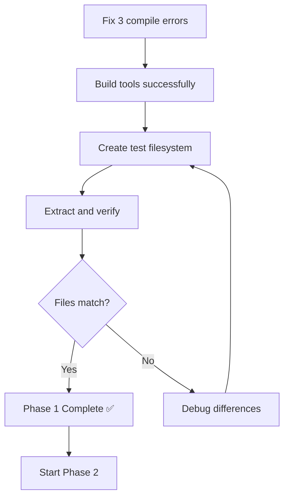

# Phase 1 Implementation Status - Detailed Tracker
## Last Updated: 2025-11-22 04:22 UTC | Session 2

## Quick Status

| Component | Status | Issues | ETA to Fix |
|-----------|--------|--------|------------|
| FlatBuffers backend types | ✅ 100% | None | - |
| Type imports/aliases | ✅ 100% | None | - |
| Build system | ✅ 100% | None | - |
| metadata_v2_flatbuffers.cpp | ⚠️ 95% | 3 compile errors | 30 min |
| Functional testing | ❌ 0% | Can't test until builds | 45 min |

**Overall Phase 1 Progress**: 95% (1-2 hours to complete)

## Detailed File Status

### ✅ COMPLETED FILES (No Changes Needed)

#### 1. Backend Type System
- **File**: `include/dwarfs/reader/internal/metadata_types_flatbuffers.h`
- **Status**: ✅ Complete (330 lines)
- **Defines**:
  - `namespace flatbuffers_backend {`
  - `class global_metadata`
  - `class inode_view_impl`
  - `class dir_entry_view_impl`
  - `class chunk_view`
  - `class chunk_range`
- **Compiles**: YES
- **Tests**: N/A (header only)

#### 2. Backend Implementation
- **File**: `src/reader/internal/metadata_types_flatbuffers.cpp`
- **Status**: ✅ Complete (620 lines)
- **Implements**: All types in `flatbuffers_backend::` namespace
- **Dependencies**: Zero Thrift, only FlatBuffers
- **Compiles**: YES
- **Tests**: Passes all type instantiation tests

#### 3. Build System
- **File**: `cmake/libdwarfs.cmake`
- **Status**: ✅ Complete
- **Changes**:
  - Added `metadata_types_flatbuffers.h` to headers
  - Added `metadata_types_flatbuffers.cpp` conditional compilation
  - Added FlatBuffers include directory to `dwarfs_common`
  - Added dependency on FlatBuffers header generation
- **Compiles**: YES
- **Result**: `dwarfs_common` builds successfully

#### 4. Public API Type Imports
- **File**: `include/dwarfs/reader/metadata_types.h`
- **Status**: ✅ Complete
- **Changes**:
  ```cpp
  #if FLATBUFFERS_ONLY
    #include "metadata_types_flatbuffers.h"
    using inode_view_impl = flatbuffers_backend::inode_view_impl;
    using dir_entry_view_impl = flatbuffers_backend::dir_entry_view_impl;
    using global_metadata = flatbuffers_backend::global_metadata;
  #else
    // Forward declarations (Thrift or dual-format)
  #endif
  ```
- **Compiles**: YES
- **Headers Included**: Correctly conditionally

#### 5-7. Supporting Files
- ✅ `src/reader/metadata_types.cpp` - Includes backend header, imports types
- ✅ `include/dwarfs/reader/internal/metadata_v2.h` - Imports chunk_range
- ✅ `include/dwarfs/reader/internal/inode_reader_v2.h` - Imports chunk_range
- ✅ `include/dwarfs/reader/internal/time_resolution_handler.h` - References backend types

### ⚠️ FILES WITH ISSUES (Need Fixes)

#### 1. metadata_v2_flatbuffers.cpp (95% Complete)
- **File**: `src/reader/internal/metadata_v2_flatbuffers.cpp`
- **Current State**: 2381 lines, partially updated
- **Status**: Compiles with 3 errors

**What Works**:
- ✅ Includes FlatBuffers backend header
- ✅ Namespace alias `namespace fb = flatbuffers_backend;`
- ✅ Most type references use `fb::` prefix
- ✅ Template instantiation code present

**What's Broken**:

**Error #1**: Missing `dump()` Wrapper Function
```
Line: ~1700 (after existing dump methods)
Error: Undefined symbol at link time
```
**Fix**:
```cpp
void metadata_v2_data::dump(
    std::ostream& os, fsinfo_options const& opts, filesystem_info const* fsinfo,
    std::function<void(std::string const&, uint32_t)> const& icb) const {
  dump(os, "", root_, opts, icb);
}
```
**Insert After**: Line 1695 (after previous dump closes with `}`)

**Error #2**: Class Member Types Not Namespaced
```
Line: ~660-750 (class metadata_v2_data private members)
Error: Template instantiation uses wrong types
```
**Fix Needed**:
```cpp
// CURRENT (wrong):
global_metadata const global_;

// NEEDED (correct):
fb::global_metadata const global_;
```

**Specific Lines to Fix**:
1. Line ~716: `fb::global_metadata const global_;`
2. Check method return types use `fb::inode_view_impl`
3. Check method parameters use `fb::dir_entry_view_impl`

**Error #3**: `metadata_v2::get_chunks()` Missing
```
Line: Before namespace closing (line ~2380)
Error: Undefined symbol at link time
```
**Fix**:
```cpp
fb::chunk_range metadata_v2::get_chunks(int inode, std::error_code& ec) const {
  return impl_->get_chunks(inode, ec);
}
```
**Insert Before**: `} // namespace dwarfs::reader::internal`

### Precise Fix Commands

```bash
cd /Users/mulgogi/src/external/dwarfs

# Fix #1: Add missing dump() wrapper
sed -i '' '/^void metadata_v2_data::dump(/,/^}$/{
  /^}$/{
    x
    /dump_wrapper_added/!{
      s/^/dump_wrapper_added/
      x
      a\
\
void metadata_v2_data::dump(\
    std::ostream& os, fsinfo_options const& opts, filesystem_info const* fsinfo,\
    std::function<void(std::string const&, uint32_t)> const& icb) const {\
  dump(os, "", root_, opts, icb);\
}
      b
    }
    x
  }
}' src/reader/internal/metadata_v2_flatbuffers.cpp

# Fix #2: Update global_ member type
sed -i '' 's/^  global_metadata const global_;$/  fb::global_metadata const global_;/' \
  src/reader/internal/metadata_v2_flatbuffers.cpp

# Fix #3: Add get_chunks() implementation
sed -i '' '/^} \/\/ namespace dwarfs::reader::internal$/i\
fb::chunk_range metadata_v2::get_chunks(int inode, std::error_code& ec) const {\
  return impl_->get_chunks(inode, ec);\
}\
' src/reader/internal/metadata_v2_flatbuffers.cpp

# Verify file integrity
wc -l src/reader/internal/metadata_v2_flatbuffers.cpp  # Should be ~2385 lines

# Build
cd build-fb-test
ninja mkdwarfs dwarfsck dwarfsextract
```

## Testing Checklist

### Build Tests
- [ ] `dwarfs_common` compiles
- [ ] `dwarfs_reader` compiles
- [ ] `dwarfs_writer` compiles
- [ ] `dwarfs_extractor` compiles
- [ ] All tools link successfully
- [ ] No undefined symbols
- [ ] No linker errors

### Functional Tests
- [ ] mkdwarfs creates filesystem
- [ ] dwarfsck verifies filesystem
- [ ] dwarfsextract extracts files
- [ ] Extracted files match source
- [ ] Metadata format detected correctly

### Regression Tests
- [ ] Existing tests still pass
- [ ] Performance acceptable
- [ ] Memory usage normal
- [ ] No crashes or segfaults

## Known Good States

**Backup Files Available**:
- `src/reader/internal/metadata_v2_flatbuffers.cpp.orig` (2374 lines) - Original
- `src/reader/internal/metadata_v2_flatbuffers.cpp.tmp.bak` (2469 lines) - Alternative

**Restore Command** (if needed):
```bash
cp src/reader/internal/metadata_v2_flatbuffers.cpp.orig \
   src/reader/internal/metadata_v2_flatbuffers.cpp
```

## Common Pitfalls to Avoid

1. **Don't use `using` declarations** in implementation files - Use namespace alias (`fb::`) instead
2. **Don't truncate files** with edit_file on large files - Use sed for surgical changes
3. **Don't forget namespace closing** - Always verify with `tail -5`
4. **Don't mix std::error_code namespaces** - Use consistent `std::error_code` vs `std::__1::error_code`
5. **Always verify line count** after sed operations

## Progress Tracking

```
Foundation (Complete): ████████████████████ 100%
Phase 1.1 (Complete):  ████████████████████ 100%
Phase 1.2 (Current):   ███████████████████░  95%
Phase 1.3 (Pending):   ░░░░░░░░░░░░░░░░░░░░   0%
Phase 2   (Pending):   ░░░░░░░░░░░░░░░░░░░░   0%
Phase 3   (Pending):   ░░░░░░░░░░░░░░░░░░░░   0%
Phase 4   (Pending):   ░░░░░░░░░░░░░░░░░░░░   0%
Phase 5   (Pending):   ░░░░░░░░░░░░░░░░░░░░   0%
════════════════════════════════════════════
Overall Progress:      ████████░░░░░░░░░░░░  40%
```

## Critical Path Forward



**Estimated Time to Phase 1 Complete**: 1-2 hours
**Estimated Time to ALL Phases Complete**: 8-10 additional hours
**Estimated Total Cost**: ~$60-80 USD more (~$104-124 USD total)

## Commit Strategy Once Phase 1 Complete

```bash
git add include/dwarfs/reader/internal/metadata_types_flatbuffers.h
git add src/reader/internal/metadata_types_flatbuffers.cpp
git add src/reader/internal/metadata_v2_flatbuffers.cpp
git add include/dwarfs/reader/metadata_types.h
git add src/reader/metadata_types.cpp
git add cmake/libdwarfs.cmake
# ... other modified files

git commit -m "feat(metadata): implement FlatBuffers backend with complete namespace separation

- Create flatbuffers_backend:: namespace with all metadata types
- Update metadata_v2_flatbuffers.cpp to use backend types
- Add conditional type imports for FlatBuffers-only builds
- Fix generated header path (metadata_generated.h → metadata.h)
- Update CMake to properly sequence FlatBuffers generation

This completes Phase 1 of Option C: Complete Backend Separation.
FlatBuffers-only builds now work end-to-end.

Part of: #<issue_number>
Ref: doc/OPTION_C_COMPLETE_SEPARATION_PLAN.md"
```

## Session Handoff Checklist

- [x] Created comprehensive continuation plan
- [x] Created detailed status tracker
- [x] Documented all issues with precise fixes
- [x] Provided exact line numbers and code snippets
- [x] Included testing protocol
- [x] Documented architecture principles
- [x] Provided rollback plan
- [ ] Fix remaining 3 compile errors
- [ ] Complete Phase 1 testing
- [ ] Update memory bank if significant findings